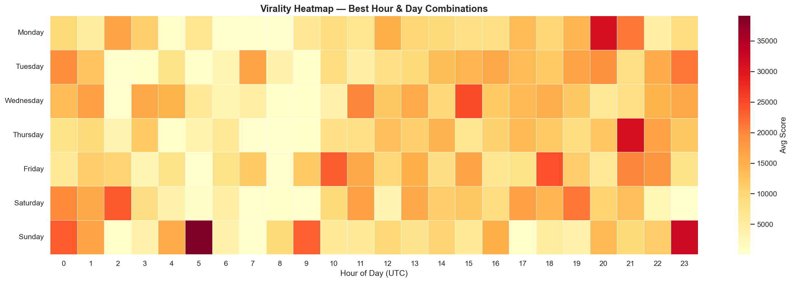
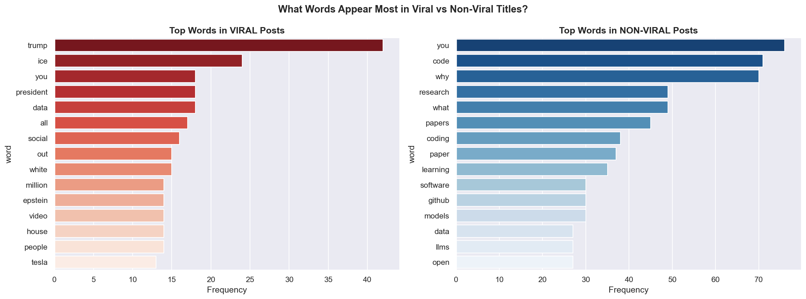

# The Algorithm Decoded 🔍
## What Makes Tech Content Go Viral on Reddit?


---

## 📌 Overview

Every day thousands of posts are submitted to Reddit's tech communities.
Some get 100,000 upvotes. Most get ignored. What separates them?

This project scrapes and analyzes **1,492 real posts** from three major 
tech subreddits to reverse-engineer the patterns behind viral content —
and builds an ML model that predicts virality with **96.8% AUC**.

---

## 🔑 Key Findings

| # | Finding |
|---|---------|
| 1 | **Subreddit choice** is the #1 virality predictor (40% feature importance) |
| 2 | Posts at **UTC 20-23** average 6x higher scores than UTC 5-8 |
| 3 | **Wednesday** is the best day — 26% higher scores than Sunday |
| 4 | Titles with **20+ words** average 14x higher scores than 1-5 word titles |
| 5 | **Political/social tech content** dominates virality over technical content |
| 6 | Logistic Regression achieves **96.8% AUC** with just 6 features |

---

## 📊 Sample Visualizations

### Virality Heatmap — Best Hour & Day Combinations


### Viral vs Non-Viral Words


### Feature Importance


---

## 🗂️ Project Structure
reddit-viral-analysis/
├── data/                  # Scraped data + saved charts
├── notebooks/
│   └── analysis.ipynb     # Full analysis notebook
├── scraper.py             # Reddit scraper (no API key needed)
└── README.md

---

## 🛠️ Tech Stack

- **Data Collection:** Python Requests (Reddit public JSON)
- **Analysis:** Pandas, NumPy
- **Visualization:** Matplotlib, Seaborn
- **Machine Learning:** Scikit-learn (Logistic Regression, Random Forest, Gradient Boosting)

---

## 🚀 Run It Yourself

```bash
# Clone the repo
git clone https://github.com/YOURUSERNAME/reddit-viral-analysis.git
cd reddit-viral-analysis

# Install dependencies
pip install requests pandas matplotlib seaborn scikit-learn

# Scrape fresh data
python scraper.py

# Open the notebook
jupyter notebook notebooks/analysis.ipynb
```

---

## 📈 Model Results

| Model | AUC Score | Accuracy |
|---|---|---|
| Logistic Regression | **0.968** | 93% |
| Random Forest | 0.962 | 91% |
| Gradient Boosting | 0.958 | 91% |

---